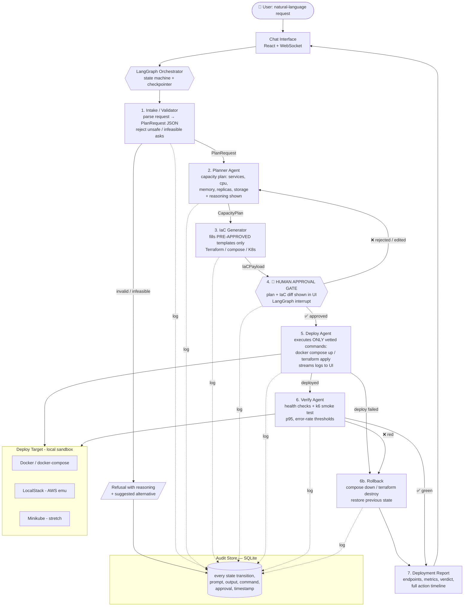

# Ops Master Agent — Workflow & State Machine

The system is a **LangGraph state machine with a hard human-approval gate** — not a free-running autonomous agent. Every transition is persisted to the audit store.

> Preview the diagram in VS Code with the **"Markdown Preview Mermaid Support"** extension (`bierner.markdown-mermaid`).

## Flow diagram (Mermaid)



## ASCII fallback (renders anywhere)

```
User NL request
      │
      ▼
 Chat UI (React) ──────────────────────────────┐
      │                                        │ live progress
      ▼                                        │ via WebSocket
 LangGraph Orchestrator (SQLite checkpointer)  │
      │                                        │
 1. INTAKE ──invalid──► REFUSE (reasoned) ──► audit + report
      │ PlanRequest
      ▼
 2. PLANNER ──► CapacityPlan (with reasoning)
      │
      ▼
 3. IaC GENERATOR (pre-approved templates only) ──► IaCPayload
      │
      ▼
 4. ██ HUMAN APPROVAL GATE ██  ◄── rejected/edited ──┐
      │ approved                                     │ loops to Planner
      ▼                                              │
 5. DEPLOY AGENT (vetted commands only) ──fail──► ROLLBACK ─┐
      │ up                                                  │
      ▼                                                     │
 6. VERIFY AGENT (health + k6 smoke) ──red──► ROLLBACK ─────┤
      │ green                                               │
      ▼                                                     ▼
 7. DEPLOYMENT REPORT  ◄────────────────────── failure report
      │
      ▼
 Chat UI (endpoints, metrics, audit timeline)

 [AUDIT STORE (SQLite)] ← every node logs: input, output, command, ts, actor
```

## State machine (LangGraph nodes & edges)

| # | Node | In → Out | Can call LLM? | Can execute commands? |
|---|---|---|---|---|
| 1 | `intake` | raw text → `PlanRequest` | ✅ | ❌ |
| 2 | `planner` | `PlanRequest` → `CapacityPlan` | ✅ | ❌ |
| 3 | `iac_generator` | `CapacityPlan` → `IaCPayload` | ✅ (fills templates) | ❌ |
| 4 | `approval_gate` | `IaCPayload` → approved/rejected | ❌ (human) | ❌ |
| 5 | `deploy` | `IaCPayload` → `DeployResult` | ❌ | ✅ allow-listed only |
| 6 | `verify` | `DeployResult` → `VerifyReport` | ✅ (summarise) | ✅ k6 + health only |
| 6b | `rollback` | any failure → restored state | ❌ | ✅ allow-listed only |
| 7 | `report` | all state → final report | ✅ (narrative) | ❌ |

**Conditional edges:** `intake→refuse` (infeasible), `gate→planner` (rejected), `deploy→rollback` (non-zero exit), `verify→rollback` (red verdict).

## The two safety rules (repeat these to judges)

1. **LLM never writes shell commands.** It fills parameters in Terraform/compose *templates* authored and vetted by InfraGenies. The deploy agent's executor has a hard allow-list (`docker compose up/down`, `terraform apply/destroy`, `kubectl apply`).
2. **Nothing deploys without a human click.** LangGraph `interrupt()` pauses the graph at node 4; state is checkpointed to SQLite, so approval can even happen after a restart.

## Data contracts

Frozen on Day 1 — see [`contracts/CONTRACTS.md`](contracts/CONTRACTS.md). Everyone builds against these; the graph passes only these JSON objects between nodes.
